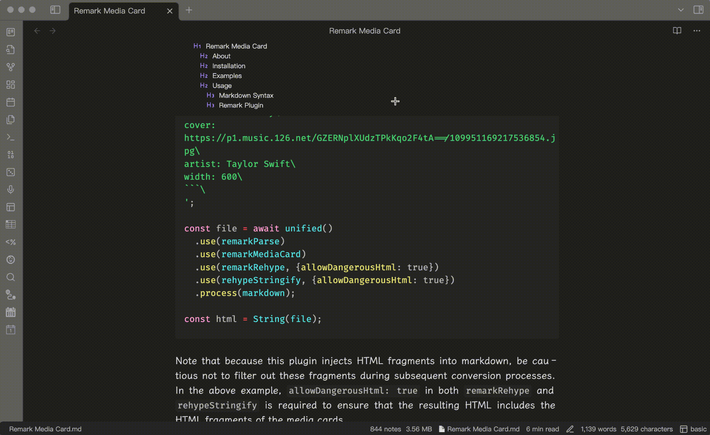

# Obsidian Sticky Headings

> [!NOTE]
>
> It wasn't until I was about to release this plugin that I discovered there's already a plugin with similar functionality in the Obsidian Plugin Market: [Obsidian Sticky Heading](https://github.com/imshenshen/obsidian-sticky-heading). I mean no offense and have no intention of duplicating work. It seems that we just happened to have the same idea and wanted to solve the same problem. The truth is, after seeing the Sticky Scroll feature in the VS Code editor, I found it incredibly useful. For the past six months, I’ve been wanting to bring this feature to the Obsidian world.
>
> In terms of implementation, these two plugins are entirely different (there's no possibility of plagiarism), and each has its unique features. Obsidian users can choose whichever suits them better. Additionally, I have a few small suggestions:
>
> * The imshenshen/obsidian-sticky-heading plugin, by default, only displays the current heading, making it more streamlined compared to my version. In my plugin, the concise mode is equivalent to the prevToH1 mode in imshenshen/obsidian-sticky-heading. Therefore, users who prefer a more minimalist appearance might choose the imshenshen/obsidian-sticky-heading plugin.
> * My plugin offers good support for both editing and reading modes, so users who need functionality in reading mode as well can opt for my version.

## Overview

The Sticky Headings plugin for Obsidian enhances your writing and reading experience by keeping the current content's heading levels displayed, providing better orientation and progress tracking. By clicking on the displayed headings, you can quickly scroll to the corresponding section in your note.

## Installation

1. Install the `Another Sticky Headings` plugin via the Obsidian Community Plugins marketplace.
2. Enable the plugin via the Obsidian Settings under the "Community Plugins" section.
3. Configure the plugin parameters as needed through the settings UI.

## Features

### Default Mode

In default mode, the heading of the current content, the ancestor headings of the current heading, and the sibling headings (that appeared previously) of these headings will all be displayed. The benefit of this approach is that it allows us to better understand what content has already been covered while editing or reading the note.

### Concise Mode

In concise mode, only the heading of the current content and the ancestor headings of the current heading will be displayed, resulting in a more streamlined presentation. The benefit of this approach is that it allows us to quickly understand the position of the current content within the overall note, enabling us to focus more on the task at hand.

### Quick Jump

The headings that are fixed at the top of the note are all clickable. By clicking on them, you can quickly scroll the note to the corresponding section.

### More

Supports both editing and reading modes, as well as multi-column layouts.

## My Other Obsidian Plugins

* [Export Image](https://github.com/zhouhua/obsidian-export-image)
* [Markdown Media Card](https://github.com/zhouhua/obsidian-markdown-media-card)
* [vConsole](https://github.com/zhouhua/obsidian-vconsole)
* [POWER MODE](https://github.com/zhouhua/obsidian-power-mode)
* [PopKit](https://github.com/zhouhua/obsidian-popkit)
